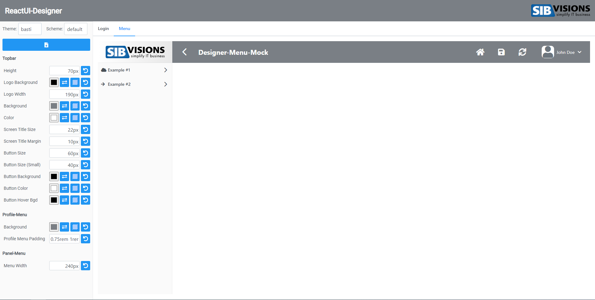
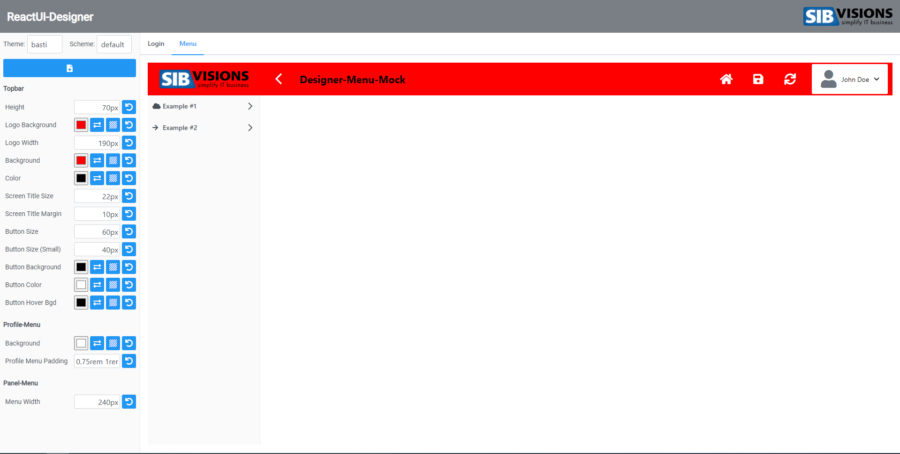

# reactUIDesigner
With this designer application for reactUI it is possible, to easily design your own color-schemes and themes. Via color-picker or text inputs you can edit the css-variables, which are used for the reactUI. The changes are updated live.

Upon pressing the download button, two css files will be downloaded. These files are to be added to the corresponding directory in the public folder of the reactUI-build or live project. 

Remember to update your config/url to tell the reactUI to use your file!

## Example (Work in Progress)
Here is the default menu, nothing is changed.

Now I changed some values to make the menu look a bit different...

