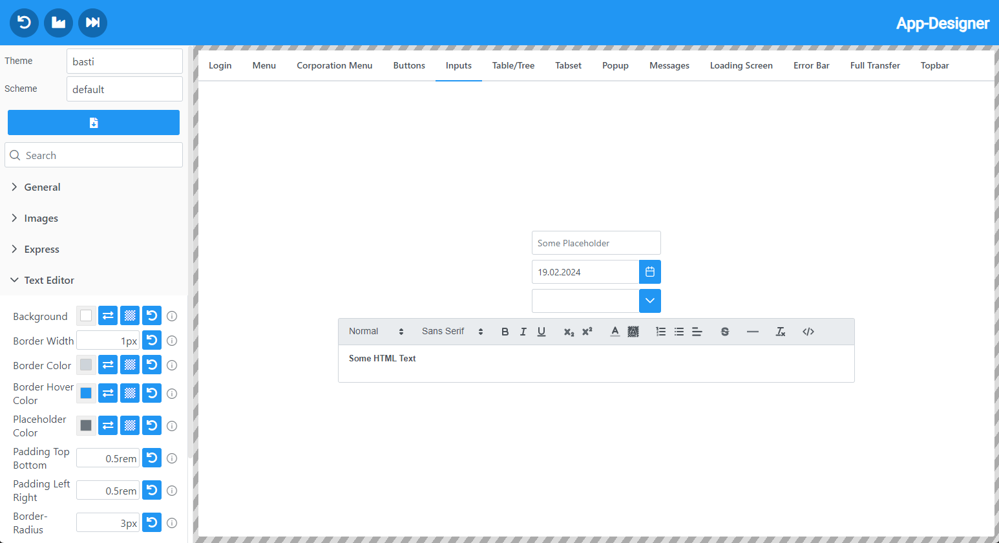
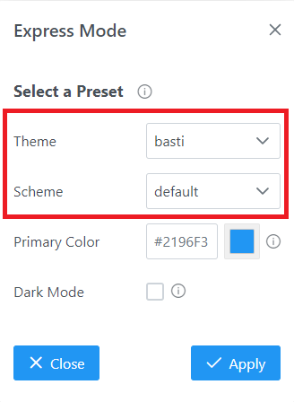
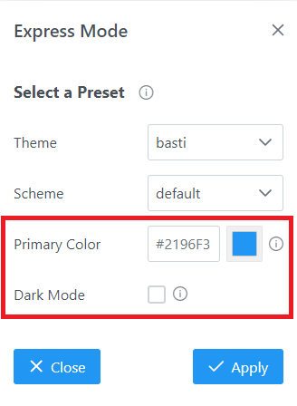

# reactUIDesigner
## Overview
The reactui-designer lets you easily easily design your own color-schemes and themes for the [ReactUI](https://github.com/sibvisions/reactUI). Via color-picker or text inputs you can edit the css-variables, which are used for in the ReactUI. The changes are updated live.

## Usage
The designer has two modes. One mode is available by cloning this repository and running the application. The other mode is used by starting the designer through the ReactUI.

### Standalone Mode
The standalone mode is independent from the ReactUI and can be started without any VisionX application.

**Installation**
1. Clone this repository.
2. Make sure up to date the color-scheme and themes are in the public folder.
3. Run `npm install` to download the dependencies of the project.
4. Run `npm start` to start the designer.

**Example**

In the standalone mode instead of your ReactUI application, you'll see a tab menu. Every tab is a group of the various components the ReactUI has to offer.

### With ReactUI
The designer can also be used directly in the ReactUI to change the styles of the application live.

**Enabling the Designer in the ReactUI**

To enable the designer in the ReactUI, the `useDesigner` property in the `app.json` file has to be set to `true`. Then the button to enable the designer will appear in the bottom right corner of the ReactUI. After enabling, the design menu will wrap the application and the sizes will be adjusted. The button to disable the designer moved from the bottom right corner into the topbar of the designer. Click it to stop designing.

**Example**

## Features

## 1. Editing CSS-Variables and create new Color-Schemes and Themes
To edit a CSS-variable expand the menu tab and edit the value of the editor.

### 1.1. Editors
There are 3 different types of editors.
#### 1.1.2 Text-Editor
The standard text-editor is a simple textinput. It is mostly used for sizes.

#### 1.1.2. Color-Editor
When not opened the color-editor displays a preview value of the currently set value. When opening the editor by clicking on the preview, a color picker is will open. In that color picker you are able to choose a color in HEX, RGBA or HSLA format.

#### 1.1.3. Color-Text-Editor
By pressing the button with the two arrows next to the color preview of the color-editor, the color-editor will be replaced by a text input field. This mode was included, so gradients and more values can be entered into color fields, which would not be possible with a color picker.

### 1.2. Editor Buttons
Next to the editors there are buttons which will either change the type of the editor or will alter the value of the editor.

#### 1.2.1 Undo Button
The 'undo' button reverts the changes made to the editor to the default value. The default value gets set at the very start and is set to the variable's value of the loaded color-scheme/theme. The default value is set to a different value, when the color-scheme/theme is changed in express-mode.

#### 1.2.2 Show Text/Show Color
The 'show text' button is exclusive to color-editors. When clicking the button the color picker is replaced by a textinput or the other way around. It was introduced so gradients could be added to color variables.

#### 1.2.3 Transparent
The transparent button is also exclusive to color-editors. When clicking it, the value of the variable gets set to 'transparent'.

## 2. Set Images of Application
The application frame of the ReactUI has three images: login, menu and collapsed menu. All of them can be replaced by uploading the new images. When the designer is started with the ReactUI (or you cloned this project, run in standalone mode, added a valid upload-url and have a VisionX server running in the background), you are able to upload the files directly to the server. You will get feedback if the upload was successful or not.

## 3. Down- and Uploading CSS-Files
After creating your own color-scheme and theme, you are able to download the generated CSS-files and/or upload them to the server. Enter a name for your color-scheme and theme to create a new one or use an already existing one to overwrite that file.

### 3.1. Downloading
To download the CSS-files click the 'download' button below the color-scheme/theme name editors. You may need to allow that your browser is able to download multiple files. The downloaded files need to be added into the 'color-schemes' respectively 'themes' directory in your 'ui/public' directory.

### 3.2. Uploading
When the designer is started with the ReactUI (or you cloned this project, run in standalone mode, added a valid upload-url and have a VisionX server running in the background), you are able to upload the files directly to the server. Simply press the 'save' button below the color-scheme/theme name editors, you will get feedback if the upload was successful or not. The uploaded files will be added into the 'color-schemes' respectively 'themes' directory in your 'ui/public' directory.

## 4. Express-Mode
By pressing the button with the 'fast forward' icon in the topbar the Express-Mode popup will open. In the Express-Mode you are able to quickly change between preset color-schemes and themes or create a completely new color-scheme based on a single color.

### 4.1. Presets
If you want to change the currently selected color-scheme/theme you can select another one of the pre-made ones the ReactUI has to offer, after confirming, the styles get applied. This sets the default values when clicking 'undo'.

### 4.2. Express Scheme
After entering a name for your custom scheme, the color picker gets enabled, after choosing a color and if the scheme should be in dark-mode or not, a new scheme is created based on the chosen color.

## 5. Reset to Default/Factory
There is also the option to reset the current changes and go back to default/factory.

### 5.1. Reset to Default
By pressing the 'undo' button in the topbar of the designer, you will be asked if you want to reset the changes, when confirming all values are being reset to default. The default values are the values, the designer sets when initially loading or when a preset is being selected in the Express-Mode.

### 5.2. Reset to Factory
If there are changes which are to be resetted to default but the default color-scheme/theme has already been overwritten and is not restorable, you can press the 'factory' button in the topbar of the designer to reset your style to the 'default' color-scheme and 'basti' theme.